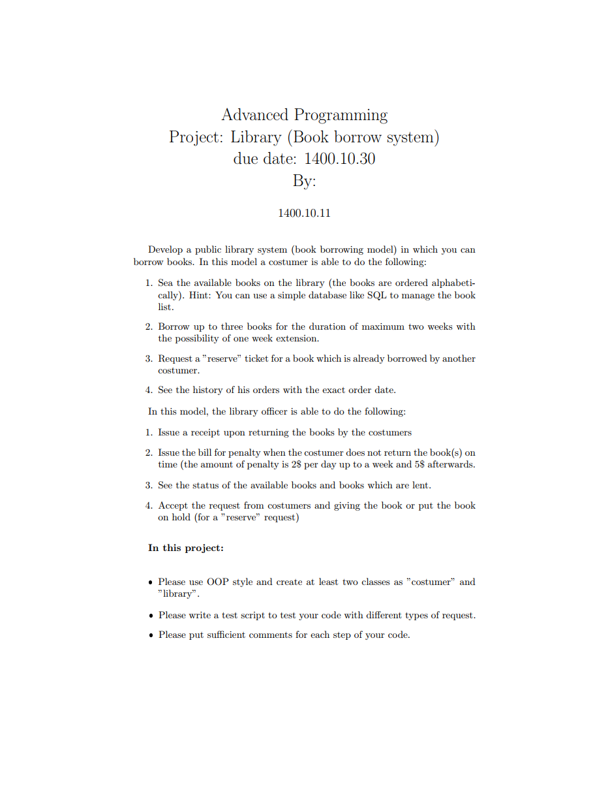

# **📚 Library Management GUI Project | پروژه مدیریت کتابخانه گرافیکی**

**A university project in which a library management system is designed using PyQT5 and has user and admin parts.**

**یک پروژه دانشگاهی که در آن یک سیستم مدیریت کتابخانه با استفاده از PyQT5 طراحی می‌شود و دارای قسمت‌های کاربر و ادمین است.**

# 💬 **نکات پروژه**

* عکس‌های برنامه در دایرکتوری ScreenShots قرار دارند.
* برای اجرا برنامه، به پایتون بالاتر از نسخه 3.6 نیاز دارید.
* کتابخانه‌های مورد نیاز در فایل requirements.txt قرار دارند.
* برای استفاده از برنامه، در صورتی که نیاز به اجرای تست‌ها دارید، قسمت **##====== while testing ======##** در ابتدای فایل‌های Code را uncomment کنید، در غیر این صورت قسمت **##====== while running ======##** را uncomment کنید.
* برای دسترسی به همه‌ی پروژه‌های دانشگاهی من، به این لینک مراجعه کنید:

👈🏻 **[پروژه‌های دانشگاهی من](https://github.com/bestmahdi2/Uni__Bachelors_SKU_Path)**

# 📝 **توضیحات پروژه**

# 🖼 **عکس‌های پروژه**

  
  
  
  
  

  

  

  

  

  

  

